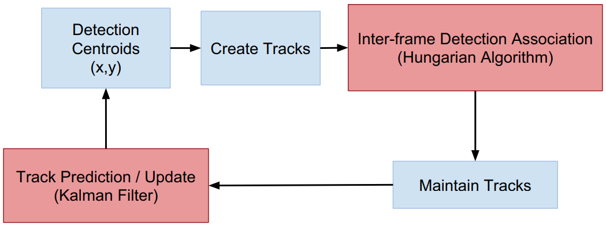

### 1. 数据体素化（可能弃用）

> 体素化是将物体几何形式表示转换成最接近物体的体素表示形式，产生体数据集，其不仅包含模型的表面信息，而且能描述模型的内部属性。表示模型的空间体素与表示图像的二维体素比较相似，只不过从二维的点扩展到三维的立方体单元，而且基于体素的三维模型有很多应用。

#### 1.1 数据体素化表示流程

由于使用的需要，需对模型进行体素化操作，这里采用了一种简单但却有效的操作方法。**首先设定模型体素化的分辨率，假设为$N \times N \times N$**，之后的操作则主要包含两部分：

- 对模型表面体素化
- 对模型内部体素化

#### 1.2 空间点的体素化

假设点位置为$(X, Y, Z)$，体素坐标系是一种局部坐标系，其X，Y，Z轴与输入点云数据的X，Y，Z轴方向相同，坐标原点与原始点云数据中三个坐标的最小值构成的点即$(X_{min}, Y_{min}, Z_{min})$相对应，**其坐标均为不小于0的整数，表示体素在该坐标轴方向中的位置。**
$$
f(x)=\left\{
\begin{aligned}
x  =  N \times INT((x-x_{min})/(x_{max}-x_{min})) \\
y  =  N \times INT((y-y_{min})/(y_{max}-y_{min})) \\
z  =  N \times INT((z-z_{min})/({z_{max}-z_{min}}))
\end{aligned}
\right.
$$

### 2. 雷达选型

相关代码包：[ti mmwave rospkg](https://github.com/radar-lab/ti_mmwave_rospkg)

#### 2.1 TI IWR1443 FMCW mmWave radars

德州仪器IWR1443毫米波雷达（工业级器件）

#### 2.2 TI AWR1443 mmWave radars

德州仪器IWR1443毫米波雷达（汽车级器件）

### 3. 相关工作

#### 3.1 Spatial Transformer Networks (STN)


STN由三部分组成：

- Localisation Network: Localisation network: 接受的输入特征图为$U \in \mathbb{R}^{H \times W \times C}$，输出为$\theta$，也就是仿射（透视）变换的变换矩阵；

- Grid Generate: 这个G是原始的图像的位置，$T_{\theta}(G)$则是的变换后的图像，原图乘以变换矩阵；
  $$
  \left[ 
  \begin{matrix} 
  x_i^s \\ 
  y_i^s \\ 
  \end{matrix} 
  \right]
  =
  T_{\theta}(G_i)=
  \left[ 
  \begin{matrix} 
  {\theta}_{11} & {\theta}_{12} & {\theta}_{13} \\ 
  {\theta}_{21} & {\theta}_{22} & {\theta}_{23} \\ 
  \end{matrix} 
  \right]
  \left[ 
  \begin{matrix} 
  x_i^t \\ 
  y_i^t \\ 
  1 \\
  \end{matrix} 
  \right]
  $$
  其中$(x_i^s,y_i^s)$指的是正正的图像，而$(x_i^t,y_i^t)$指的是旋转平移的图像。

- Sampler: 采样器根据$T_{\theta}(G)$中的坐标位置，在原始图中采样，将U中的像素复制到目标图V中。

#### 3.2 PointNet

点云一般有如下特征：

- 无序性：在几何上，点的顺序不影响它在空间中对整体形状的表示，例如，相同的点云可以由两个完全不同的矩阵表示。比如下图：
  $$
  \left[ 
  \begin{matrix} 
  0 & 1 & 2 \\ 
  3 & 4 & 5 \\ 
  \end{matrix} 
  \right] 
  \not=
  \left[ 
  \begin{matrix} 
  3 & 4 & 5 \\ 
  0 & 1 & 2 \\ 
  \end{matrix} 
  \right]
  $$

- 旋转性：相同的点云在空间中经过一定的刚性变化（旋转或平移），坐标发生变化，但实际上其本质未变；
- 相互作用：点是来自一个有距离度量的空间，这意味着点云并不是孤立的，相邻的点形成一个有意义的子集。

PointNet核心思想：

- 使用对称函数解决点云无序性的问题：
  $$
  f({x_1,...,x_n}) \approx g(h(x_1),...,h(x_n))
  $$
  
- 

其中，$h$为简单神经网络（线性变换+点卷积+MLP），g为对称函数，可以用MaxPool、MeanPool、SumPool等操作，在论文中使用的是Maxpool。


**注意：PointNet代码里的STN3d和STNkd指的是原STN论文中的第一步(Localisation Network: Localisation network)**

#### 3.3 PointNet++

在PointNet++是PointNet的扩展，为弥补PointNet没有考虑**点云相互作用**的的问题，因此提出的PointNet++。

PointNet++如下结构：


PointNet架构主要是set abstraction操作，而这个操作分为三步：

- Sampling：这个操作主要是选取**局部区域的中心**，采用的算法为FPS(Farthest Point Sampling)，这种采样方法可以尽可能覆盖空间中的点，详情可点[此处](https://blog.csdn.net/QFJIZHI/article/details/103419044)。这一层网络的输入为$(N,d+C)$，其中N为点云所有点的个数，d为该点的位置，C为该点特征。在这个阶段，我们可以得到$N'$个中心点（人为定义$N'$）。
- Grouping：在这个阶段，我们需要使用KNN算法或者欧氏距离画圆进行多个group的点的划分，在上一步我们得到了$N'$个中心点，假设每个group的点个数为K（KNN算法），那么最终输出的数据格式为$(N',K,d+C')$，其中，d为各点的位置，C'为各点特征。
- pointnet：如上一章节$f({x_1,...,x_n}) \approx g(h(x_1),...,h(x_n))$


#### 3.4 Attention

> 深度学习中的注意力可以被广泛地理解为表示重要性的权重向量。为了推测或判断一个元素，例如图像中的像素或句子中的单词，我们使用注意力权重来估计其他元素与其相关的强度，并将由注意力权重加权的值的总和作为计算最终目标的特征。

Attention主要分为如下两步（很像是图像处理中权重不一致的Pooling操作）：

- Step 1：计算其他元素与待预测元素的相关性权重；
- Step 2：根据相关性权重对其他元素进行加权求和；


Attention的公式为：
$$
Attention(Q, K, V) = softmax(\frac {QK^T}{\sqrt{d_k}})V
$$
其中，Q，K，V全部来自于mlp的提取特征。为了更好地理解Q(Query)，K(Key)，V(Value)，我们可以将Q理解为想要查询的词（比如为了预测$y_i$，我们可以将已经预测好的$y_{i-1}$作为Q），K则是当前输入的特征向量（比如为了预测$y_i$，我们可以将当前$x_i$的隐含层$h_i$作为K（多个值）），V则是当前输入的另一个特征向量（比如为了预测$y_i$，我们可以将V=K）。那么在Seq2Seq的案例中，我们的attention 的公式可以表示为：
$$
s_i = \sum a_{i,i}h_i
$$
其中：
$$
a_{i,i} = align(y_i,h_i)=\frac {exp(score(s_{i-1},h_i))}{\sum \nolimits_{j=0}^{n} exp(score(s_{i-1},h_j))}
$$

#### 3.5 Transformer


Transformer结构如上图，在Multi-Head Attention的模块，三个分叉分别为K，V，Q。当K，V，Q全部来自于同一个张量时，我们称之为Self-Attention，当Q来自于已经预测好的$y_{i-1}$时，这时，我们称之为Encoder-Decoder Attention。

#### 3.5 mID

这个算法是一个非常好的追踪算法，一共需要三个步骤，如下图。为了捕捉连续的点云来追踪和识别一个人，我们需要一个有效的时间关联检测，以及校正和预测传感器噪声。我们从每一帧创建并维护目标检测轨迹。新的轨迹将由目标检测创建，该轨迹要么来自于第一个传入帧，要么来自无法与现有轨迹关联的对象检测（使用Hungarian Algorithm来进行帧间对象关联）。**如果一个追踪对象在$D$个连续帧中未被检测到，我们将该轨迹标记为非活动，并将其从后续关联中排除。最后，我们应用Kalman Filter来预测和校正轨迹。**



- DBScan: E=0.05领域是指给定点半径为E的区域，如果给定点E领域内的样本点数大于等于MinPts=20，则该点为核心点。在这篇论文中，距离计算公式如下：
  $$
  D(p^i,p^j)=(p^i_x-p^j_x)^2+(p^i_y-p^j_y)^2+\alpha*(p^i_z-p^j_z)^2
  $$
  其中，$\alpha = 0.25$，因为在作者的观察中，z轴方向（人的身高）往往会有很多的离散点，对于目标检测并没有用（噪声）。

- Hungarian Algorithm: 对于两帧图片中找到的可能的人，我们需要进行关联（二分图最大匹配）。需要的算法为**匈牙利算法或者K-M算法**。

- Kalman Filter: 使用卡尔曼滤波进行轨迹校正（**去除交叉情况下ID匹配错误的情况**）。

事实上，mID提出的方法**（DBScan+匈牙利算法+卡尔曼滤波）**已经成为了毫米波雷达做多目标追踪的经典方法。

### 4. 代码

#### 4.1 HAR/code_lstm

这一版的代码主要是作为对比，由于我们之后的论文基本都用了LSTM，因此我们计划是使用相同的配置进行最终效果的对比（尤其是和PointGNN）

最终测试的结果为：

```python
Test Accuracy 23.8630%
epoch:1	 epoch loss:189.8299
Test Accuracy 35.6822%
epoch:2	 epoch loss:178.9261
Test Accuracy 41.6901%
epoch:3	 epoch loss:173.0116
Test Accuracy 43.5149%
epoch:4	 epoch loss:170.0830
Test Accuracy 43.8237%
epoch:5	 epoch loss:168.5532
Test Accuracy 44.1044%
epoch:6	 epoch loss:167.7885
Test Accuracy 44.2448%
epoch:7	 epoch loss:167.3001
Test Accuracy 44.4413%
epoch:8	 epoch loss:167.0112
Test Accuracy 44.4975%
epoch:9	 epoch loss:166.8356
Test Accuracy 44.5817%
epoch:10	 epoch loss:166.7532
Test Accuracy 44.6098%
epoch:11	 epoch loss:166.7044
Test Accuracy 44.6098%
epoch:12	 epoch loss:166.6888
Test Accuracy 44.6098%
epoch:13	 epoch loss:166.5931
Test Accuracy 44.5817%
epoch:14	 epoch loss:166.5834
Test Accuracy 44.5817%
epoch:15	 epoch loss:166.5637
```


#### 4.2 HAR/code_v1(TDCNN+LSTM)

第一版代码主要来源于论文《RadHAR: Human Activity Recognition from Point Clouds Generated through a Millimeter-wave Radar》 在其github代码上修改而来的TD_CNN_LSTM网络（Pytorch版本） 代码地址为：https://github.com/nesl/RadHAR

在我们的测试中，最终结果在第12个epoch达到了86%，一定程度上可以说明该网络的有效性：

```python
Test Accuracy 20.6049%
epoch:0	 epoch loss:2497.9695
Test Accuracy 59.7795%
epoch:1	 epoch loss:1980.7943
Test Accuracy 78.1798%
epoch:2	 epoch loss:1769.9320
Test Accuracy 82.9565%
epoch:3	 epoch loss:1685.8812
Test Accuracy 85.8960%
epoch:4	 epoch loss:1643.4520
Test Accuracy 87.0548%
epoch:5	 epoch loss:1618.5165
Test Accuracy 86.2634%
epoch:6	 epoch loss:1605.9521
Test Accuracy 86.0090%
epoch:7	 epoch loss:1597.8629
Test Accuracy 84.5393%
epoch:8	 epoch loss:1590.9446
Test Accuracy 87.3940%
epoch:9	 epoch loss:1584.7410
Test Accuracy 87.5636%
epoch:10	 epoch loss:1582.8142
Test Accuracy 85.4720%
epoch:11	 epoch loss:1579.6831
Test Accuracy 84.8785%
epoch:12	 epoch loss:1575.7629
Test Accuracy 86.9700%
```

这一版的代码使用了体素化表示点云，当前版本代码存在问题：

- 体素化表示点云处理过程复杂，稀疏点占用空间巨大，无法实现端到端；

- 没有显式的局部信息获取；
- 点云本质具有set的性质，本身是无序信息，而图像（立体场景）是有序信息；
- 速度信息未考虑。


#### 4.3 HAR/code_v2(TDPointNet+LSTM)

这一版的代码主要使用了PointNet和STN以及BLSTM组合的结构，没有使用点云体素化，而是使用了(batch_size, 60, 42, 3)这样**占用空间很小**，处理很快的点云集合。最终得到的效果如下图（前50个epoch的学习率为0.00001，51-72的学习率为0.000001），**这个版本的代码已经超过了RadHAR论文中90%的最高准确率**：

```python
epoch:50	 epoch loss:137.8508
Test Accuracy 91.8024%
epoch:51	 epoch loss:137.8264
Test Accuracy 91.7462%
epoch:52	 epoch loss:137.8304
Test Accuracy 92.0270%
epoch:53	 epoch loss:137.8096
Test Accuracy 92.7007%
epoch:54	 epoch loss:137.7618
Test Accuracy 91.9708%
epoch:55	 epoch loss:137.7401
Test Accuracy 92.1112%
epoch:56	 epoch loss:137.7477
Test Accuracy 92.0550%
epoch:57	 epoch loss:137.7485
Test Accuracy 91.1286%
epoch:58	 epoch loss:137.7491
Test Accuracy 91.2970%
epoch:59	 epoch loss:137.7663
Test Accuracy 91.6901%
epoch:60	 epoch loss:137.7136
Test Accuracy 92.1393%
epoch:61	 epoch loss:137.7390
Test Accuracy 91.4655%
epoch:62	 epoch loss:137.7053
Test Accuracy 91.3812%
epoch:63	 epoch loss:137.7313
Test Accuracy 90.5671%
epoch:64	 epoch loss:137.7269
Test Accuracy 91.7743%
epoch:65	 epoch loss:137.7476
Test Accuracy 91.2970%
epoch:66	 epoch loss:137.7277
Test Accuracy 91.0444%
epoch:67	 epoch loss:137.8045
Test Accuracy 91.6901%
epoch:68	 epoch loss:137.7187
Test Accuracy 92.3077%
epoch:69	 epoch loss:137.7257
Test Accuracy 93.3745%
epoch:70	 epoch loss:137.7416
Test Accuracy 92.0831%
epoch:71	 epoch loss:137.6977
Test Accuracy 91.4935%
epoch:72	 epoch loss:137.7179
Test Accuracy 92.0550%
epoch:73	 epoch loss:137.6846
Test Accuracy 92.1393%
epoch:74	 epoch loss:137.7253
Test Accuracy 91.4935%
epoch:75	 epoch loss:137.6949
Test Accuracy 92.1393%
epoch:76	 epoch loss:137.6889
Test Accuracy 92.3077%
epoch:77	 epoch loss:137.6856
Test Accuracy 91.5497%
epoch:78	 epoch loss:137.7148
Test Accuracy 92.3077%
```

#### 4.4 HAR/code_v3(TDPointGNN+LSTM)

当前版本使用的框架是PointGNN+LSTM

设置为$T = 3,r=0.05,learning\,rate=0.0001,optim_{LR}=0.6,state_dim=3(xyz)$，每个顶点的平均边为30，结果为：

```python
Test Accuracy 23.7226%
epoch:1	 epoch loss:1657.6987
Test Accuracy 63.1106%
epoch:2	 epoch loss:1362.5378
Test Accuracy 70.9152%
epoch:3	 epoch loss:1307.5026
Test Accuracy 73.3015%
epoch:4	 epoch loss:1286.3761
Test Accuracy 74.7052%
epoch:5	 epoch loss:1276.6403
Test Accuracy 74.3403%
epoch:6	 epoch loss:1270.6652
Test Accuracy 74.8175%
epoch:7	 epoch loss:1267.3583
Test Accuracy 74.5368%
epoch:8	 epoch loss:1265.3301
Test Accuracy 74.8175%
epoch:9	 epoch loss:1264.2133
Test Accuracy 74.9579%
epoch:10	 epoch loss:1263.4835
Test Accuracy 75.0140%
epoch:11	 epoch loss:1263.0441
Test Accuracy 75.0140%
epoch:12	 epoch loss:1262.7979
Test Accuracy 74.9579%

```

设置为$T = 3,r=0.0005,learning\,rate=0.0001,optim_{LR}=0.6,state_dim=3(xyz)$，每个顶点的平均边为10，结果为：

```python
Test Accuracy 20.1011%
epoch:1	 epoch loss:1638.2410
Test Accuracy 56.1202%
epoch:2	 epoch loss:1401.5388
Test Accuracy 70.8591%
epoch:3	 epoch loss:1309.8812
Test Accuracy 72.7400%
epoch:4	 epoch loss:1287.3472
Test Accuracy 73.2734%
epoch:5	 epoch loss:1276.7604
Test Accuracy 73.5542%
epoch:6	 epoch loss:1270.7698
Test Accuracy 73.8630%
epoch:7	 epoch loss:1267.1136
Test Accuracy 74.1718%
epoch:8	 epoch loss:1265.4233
Test Accuracy 73.9472%
epoch:9	 epoch loss:1264.0820
Test Accuracy 74.1437%
epoch:10	 epoch loss:1263.3696
Test Accuracy 74.0034%
epoch:11	 epoch loss:1262.9706
Test Accuracy 74.2560%
epoch:12	 epoch loss:1262.6624
Test Accuracy 74.2560%
epoch:13	 epoch loss:1262.5419
Test Accuracy 74.1999%
epoch:14	 epoch loss:1262.5200
Test Accuracy 74.2280%
epoch:15	 epoch loss:1262.3126
Test Accuracy 74.2280%
epoch:16	 epoch loss:1262.2665
Test Accuracy 74.2280%
epoch:17	 epoch loss:1262.2375
Test Accuracy 74.2280%
epoch:18	 epoch loss:1262.2306
Test Accuracy 74.2280%
epoch:19	 epoch loss:1262.2253
Test Accuracy 74.2280%
epoch:20	 epoch loss:1262.3317
Test Accuracy 74.2280%
epoch:21	 epoch loss:1262.3201
Test Accuracy 74.2280%
epoch:22	 epoch loss:1262.2209
Test Accuracy 74.2280%
epoch:23	 epoch loss:1262.3145
Test Accuracy 74.2280%
epoch:24	 epoch loss:1262.2755
Test Accuracy 74.2280%
epoch:25	 epoch loss:1262.2997
Test Accuracy 74.2280%
epoch:26	 epoch loss:1262.2167
Test Accuracy 74.2280%
epoch:27	 epoch loss:1262.4041
Test Accuracy 74.2280%
epoch:28	 epoch loss:1262.2290
Test Accuracy 74.2280%
epoch:29	 epoch loss:1262.3732
Test Accuracy 74.2280%
epoch:30	 epoch loss:1262.3842
Test Accuracy 74.2280%
epoch:31	 epoch loss:1262.2272
Test Accuracy 74.2280%
```

**这里一定程度上可以说明，顶点邻接点的个数对于最终的结果影响是不大的**

我们将毫米波雷达的所有参数加上，因此state_dim=8（包括该点的位置），$T = 3,r=0.0005,learning\,rate=0.001,optim_{LR}=0.8,state_dim=8$，最终的结果如下：

```python
Test Accuracy 86.8052%
epoch:18         epoch loss:1630.4952    learning rate:0.00040500000000000003
Test Accuracy 88.0685%
epoch:19         epoch loss:1603.5416    learning rate:0.0003645
Test Accuracy 88.0124%
epoch:20         epoch loss:1593.4146    learning rate:0.00032805000000000003
Test Accuracy 88.9669%
epoch:21         epoch loss:1587.6666    learning rate:0.000295245
Test Accuracy 89.8933%
epoch:22         epoch loss:1586.7390    learning rate:0.0002657205
Test Accuracy 90.8478%
epoch:23         epoch loss:1580.0706    learning rate:0.00023914845
Test Accuracy 90.3425%
epoch:24         epoch loss:1581.9740    learning rate:0.000215233605
Test Accuracy 90.3144%
epoch:25         epoch loss:1577.9630    learning rate:0.0001937102445
Test Accuracy 91.4093%
epoch:26         epoch loss:1575.1732    learning rate:0.00017433922005
Test Accuracy 91.9708%
epoch:27         epoch loss:1573.7748    learning rate:0.00015690529804500002
Test Accuracy 91.1286%
epoch:28         epoch loss:1574.0050    learning rate:0.00014121476824050002
Test Accuracy 91.1005%
epoch:29         epoch loss:1573.1562    learning rate:0.00012709329141645002
Test Accuracy 91.0163%
epoch:30         epoch loss:1573.7720    learning rate:0.00011438396227480502
Test Accuracy 90.7636%
epoch:31         epoch loss:1573.1935    learning rate:0.00010294556604732453
Test Accuracy 92.1112%
epoch:32         epoch loss:1572.6886    learning rate:9.265100944259208e-05
Test Accuracy 91.1847%
epoch:33         epoch loss:1572.3966    learning rate:8.338590849833288e-05
Test Accuracy 91.8585%
epoch:34         epoch loss:1572.0251    learning rate:7.50473176484996e-05
Test Accuracy 92.1673%
epoch:35         epoch loss:1571.8701    learning rate:6.754258588364964e-05
Test Accuracy 91.6058%
epoch:36         epoch loss:1571.8706    learning rate:6.078832729528468e-05
Test Accuracy 91.2409%
epoch:37         epoch loss:1571.6724    learning rate:5.4709494565756215e-05
Test Accuracy 91.7181%

```

其中的最高准确率达到了92.167%，我们在此基础上对点云图神经网络进行了修改，将其连接边也进行了更新。代码如HAR/code_v3。

#### 4.5 HAR/code_v3(TDPointGNN_boost+LSTM)

我们修改了PointGNN的更新方式$T = 3,r=5,learning\,rate=0.001,optim_{LR}=0.8,state_dim=8$，在每帧图像都得到[42, 8]个状态值后，我们又对8个状态映射为[42, 128]。取最大后的结果为[128]输入Bi-LSTM。

更新公式如下：
$$
\Delta x_i^t = MLP_{h}^{t}(s_i^t) \\
e_{ij}^t = MLP_f^t([x_j-x_i + \Delta x_i^t, s_j^t]) \\
\Delta A^t = MLP_r^t(e_{ij}^t) \\
A^{(t+1)} = hard\_sigmoid(3*(A^t + \Delta A^t)) \\
s_i^{t+1} = MLP_g^t(Max\{e_{ij}|(i,j) \in E^t\})+s_i^t
$$

在网络推断时，$A^{t+1}$的求取方式更改为：
$$
A^{t+1} =\{A_{ij}^{t+1}=1|A_{ij}^t+\Delta A_{ij}^t > 0\}
$$


最终的结果如下：

```python
epoch:42         epoch loss:2212.4436    learning rate:0.00042805066795449306
Test Accuracy 94.2729%
epoch:43         epoch loss:2208.4946    learning rate:0.0004194896545954032
Test Accuracy 96.9680%
epoch:44         epoch loss:2212.3975    learning rate:0.0004110998615034951
Test Accuracy 95.4239%
epoch:45         epoch loss:2207.8750    learning rate:0.00040287786427342523
Test Accuracy 95.4520%
epoch:46         epoch loss:2208.2219    learning rate:0.00039482030698795675
Test Accuracy 95.6204%
epoch:47         epoch loss:2211.0491    learning rate:0.0003869239008481976
Test Accuracy 94.9467%
epoch:48         epoch loss:2209.0977    learning rate:0.0003791854228312336
Test Accuracy 95.3959%
epoch:49         epoch loss:2212.6357    learning rate:0.00037160171437460894
Test Accuracy 95.6204%
epoch:50         epoch loss:2207.3765    learning rate:0.00036416968008711674
Test Accuracy 95.2836%
epoch:51         epoch loss:2207.7761    learning rate:0.0003568862864853744
Test Accuracy 94.8624%
epoch:52         epoch loss:2207.7495    learning rate:0.0003497485607556669
Test Accuracy 94.6098%
epoch:53         epoch loss:2207.8184    learning rate:0.00034275358954055353
Test Accuracy 95.0028%
epoch:54         epoch loss:2209.1448    learning rate:0.00033589851774974244
Test Accuracy 94.0483%
epoch:55         epoch loss:2207.2847    learning rate:0.0003291805473947476
Test Accuracy 95.1151%
epoch:56         epoch loss:2206.5386    learning rate:0.0003225969364468526
Test Accuracy 94.6378%
```

在MMPoint-GNN中，我们的方法很快达到了96.9680%的准确率，超过了code_v中的93%，目前是效果最好的网络。
